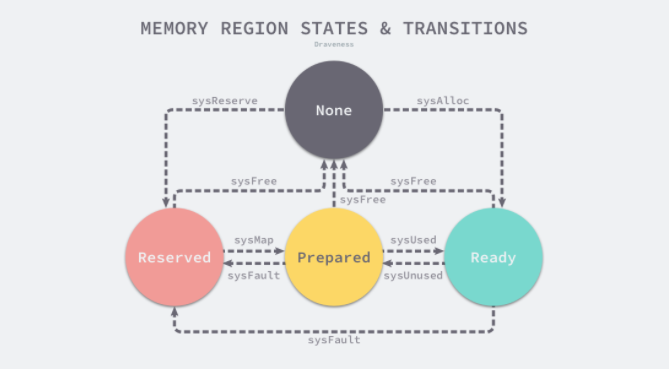
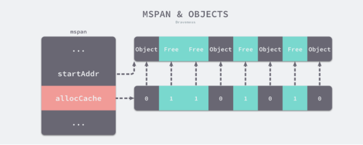
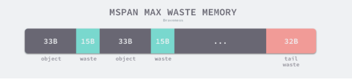

# 内存

## 操作系统内存管理


### Go内存管理

#### 内存分配器
Go程序中数据的变量会被分配到程序所在**虚拟内存**中,内存空间中包含两个重要区域: 栈区(stack)和堆区(heap).栈中的内存会由编译器进行管理,Go中堆内存会由工程师与编译器共同管理.

### 两种分配方法

#### 线性分配器
- **分配方法**   
线性分配（Bump Allocator）是一种高效的内存分配方法，但是有较大的局限性。当我们使用线性分配器时，只需要在内存中维护一个指向内存特定位置的指针，如果用户程序向分配器申请内存，分配器只需要检查剩余的空闲内存、返回分配的内存区域并修改指针在内存中的位置，即移动下图中的指针：

**图 2-1 线性分配器**   

	虽然线性分配器实现为它带来了较快的执行速度以及较低的实现复杂度，但是线性分配器无法在内存被释放时重用内存。如下图所示，如果已经分配的内存被回收，线性分配器无法重新利用红色的内存：

**图 2-2 线性分配器**   

	因为线性分配器具有上述特性，所以需要与合适的垃圾回收算法配合使用，例如：标记压缩（Mark-Compact）、复制回收（Copying GC）等算法，它们可以通过拷贝的方式整理存活对象的碎片，将空闲内存定期合并，这样就能利用线性分配器的效率提升内存分配器的性能了。
- **线性分配器相关垃圾回收算法**   
	- 标记压缩算法
	标记压缩算法主要分为两个阶段:标记阶段与压缩阶段.
	1. 标记阶段   
	标记阶段与标记清楚法标记阶段是一样.
	2. 压缩阶段
	压缩阶段的工作是移动所有可达对象到堆内存的同一个区域,从而将所有空闲内存线性排布以供下次分配.
	3. 算法实现
	Two-Finger算法,LISP2算法
	- 复制回收算法
	1. 标记阶段   
	同上
	2. 复制阶段
	将已经标记的活动对象复制到其他空间,把原有空间的所有对象回收.

#### 空闲链表分配器
空闲链表分配器（Free-List Allocator）可以重用已经被释放的内存，它在内部会维护一个类似链表的数据结构。当用户程序申请内存时，空闲链表分配器会依次遍历空闲的内存块，找到足够大的内存，然后申请新的资源并修改链表：

**图 2-3 空间链表分配器**   
需要注意由于内存块通过指针构成了链表,所以再适配内存时,需要消耗$O(n)$的时间复杂度.内存块的分配策略也有常见的四种方式:
* 首次适应 （First-Fit）— 从链表头开始遍历，选择第一个大小大于申请内存的内存块；
* 循环首次适应 （Next-Fit）— 从上次遍历的结束位置开始遍历，选择第一个大小大于申请内存的内存块；
* 最优适应 （Best-Fit）— 从链表头遍历整个链表，选择最合适的内存块；
* 隔离适应 （Segregated-Fit）— 将内存分割成多个链表，每个链表中的内存块大小相同，申请内存时先找到满足条件的链表，再从链表中选择合适的内存块；

上述四种策略的前三种就不过多介绍了，Go 语言使用的内存分配策略与第四种策略有些相似，我们通过下图了解该策略的原理：

**图 2-4 隔离适应策略**   
如上图所示，该策略会将内存分割成由 4、8、16、32 字节的内存块组成的链表，当我们向内存分配器申请 8 字节的内存时，它会在上图中找到满足条件的空闲内存块并返回。隔离适应的分配策略减少了需要遍历的内存块数量，提高了内存分配的效率。

### 分级分配 
线程缓存分配（Thread-Caching Malloc，TCMalloc）是用于分配内存的机制，它比 glibc 中的 malloc 还要快很多2。Go 语言的内存分配器就借鉴了 TCMalloc 的设计实现高速的内存分配，它的核心理念是使用多级缓存将对象根据大小分类，并按照类别实施不同的分配策略。

### 对象大小
Go 语言的内存分配器会根据申请分配的内存大小选择不同的处理逻辑，运行时根据对象的大小将对象分成微对象、小对象和大对象三种：
|类别|大小|
|----|----|
|微对象|(0,16B)|
|小对象|[16B,32KB]|
|大对象|(32KB,+$\infty$)|

### 多级缓存 
内存分配器不仅会区别对待大小不同的对象，还会将内存分成不同的级别分别管理，TCMalloc 和 Go 运行时分配器都会引入线程缓存（Thread Cache）、中心缓存（Central Cache）和页堆（Page Heap）三个组件分级管理内存：


- 线程缓存   
线程缓存是属于每一个线程的,它能满足绝大多数的内存分配需求.
- 中心缓存
当线程缓存不能满足需求的时候,中心缓存可以作为补充解决小对象的内存分配.
- 页堆
在遇到32KB以上的对象时,内存分配会选择页堆分配大内存.

### 线性内存
Go 语言程序的 1.10 版本在启动时会初始化整片虚拟内存区域，如下所示的三个区域 spans、bitmap 和 arena 分别预留了 512MB、16GB 以及 512GB 的内存空间，这些内存并不是真正存在的物理内存，而是虚拟内存：

**堆区的线性内存**
* **spans** 区域存储了指向内存管理单元 runtime.mspan 的指针，每个内存单元会管理几页的内存空间，每页大小为 8KB；
* **bitmap** 用于标识 arena 区域中的那些地址保存了对象，位图中的每个字节都会表示堆区中的 32 字节是否空闲；
* **arena** 区域是真正的堆区，运行时会将 8KB 看做一页，这些内存页中存储了所有在堆上初始化的对象；

### 稀疏内存
在Go1.11版本之后,Go对于堆内存的管理采用的是稀疏内存方案.主要是为了解决**使用线性内存导致的地址冲突,以及与C语言混编的内存分配问题**.但是由于采用了稀疏内存管理,失去了内存连续性的优势,这使得内存管理更加复杂.
   

如上图所示，运行时使用二维的 runtime.heapArena 数组管理所有的内存，每个单元都会管理 64MB 的内存空间：

```go
type heapArena struct {
	bitmap       [heapArenaBitmapBytes]byte
	spans        [pagesPerArena]*mspan
	pageInUse    [pagesPerArena / 8]uint8
	pageMarks    [pagesPerArena / 8]uint8
	pageSpecials [pagesPerArena / 8]uint8
	checkmarks   *checkmarksMap
	zeroedBase   uintptr
}
```
该结构体中的 bitmap 和 spans 与线性内存中的 bitmap 和 spans 区域一一对应，zeroedBase 字段指向了该结构体管理的内存的基地址。上述设计将原有的连续大内存切分成稀疏的小内存，而用于管理这些内存的元信息也被切成了小块。

### 地址空间

因为所有的内存最终都是要从操作系统中申请的，所以 Go 语言的运行时构建了操作系统的内存管理抽象层，该抽象层将运行时管理的地址空间分成以下四种状态8：

|状态|解释|
|-----|----|
|None|内存没有被保留或者映射，是地址空间的默认状态|
|Reserved|运行时持有该地址空间，但是访问该内存会导致错误|
|Prepared|内存被保留，一般没有对应的物理内存访问该片内存的行为是未定义的可以快速转换到Ready状态|
|Ready|可以被安全访问|   


**地址空间状态转移图**

* runtime.sysAlloc 会从操作系统中获取一大块可用的内存空间，可能为几百 KB 或者几 MB；
* runtime.sysFree 会在程序发生内存不足（Out-of Memory，OOM）时调用并无条件地返回内存；
* runtime.sysReserve 会保留操作系统中的一片内存区域，访问这片内存会触发异常；
* runtime.sysMap 保证内存区域可以快速转换至就绪状态；
* runtime.sysUsed 通知操作系统应用程序需要使用该内存区域，保证内存区域可以安全访问；
* runtime.sysUnused 通知操作系统虚拟内存对应的物理内存已经不再需要，可以重用物理内存；
* runtime.sysFault 将内存区域转换成保留状态，主要用于运行时的调试；

运行时使用 Linux 提供的 mmap、munmap 和 madvise 等系统调用实现了操作系统的内存管理抽象层，抹平了不同操作系统的差异，为运行时提供了更加方便的接口

### 内存管理组件

Go 语言的内存分配器包含内存管理单元、线程缓存、中心缓存和页堆几个重要组件，对应的数据结构分别是**runtime.mspan**、**runtime.mcache**、**runtime.mcentral** 和 **runtime.mheap**.


所有的 Go 语言程序都会在启动时初始化如上图所示的内存布局，每一个处理器都会分配一个线程缓存 runtime.mcache 用于处理微对象和小对象的分配，它们会持有内存管理单元 runtime.mspan。

每个类型的内存管理单元都会管理特定大小的对象，当内存管理单元中不存在空闲对象时，它们会从 runtime.mheap 持有的 134 个中心缓存 runtime.mcentral 中获取新的内存单元，中心缓存属于全局的堆结构体 runtime.mheap，它会从操作系统中申请内存。

### 内存管理单元
runtime.mspan 是 Go 语言内存管理的基本单元，该结构体中包含 next 和 prev 两个字段，它们分别指向了前一个和后一个 runtime.mspan：
```go 
type mspan struct {
	next *mspan
	prev *mspan
	...
}
```
串联后的上述结构体会构成如下双向链表，运行时会使用 runtime.mSpanList 存储双向链表的头结点和尾节点并在线程缓存以及中心缓存中使用。


### 页和内存
每个 runtime.mspan 都管理 npages 个大小为 8KB 的页，这里的页不是操作系统中的内存页，它们是操作系统内存页的整数倍，该结构体会使用下面这些字段来管理内存页的分配和回收：
```go 
type mspan struct {
	startAddr uintptr // 起始地址
	npages    uintptr // 页数
	freeindex uintptr

	allocBits  *gcBits
	gcmarkBits *gcBits
	allocCache uint64
	...
}
```

* startAddr 和 npages — 确定该结构体管理的多个页所在的内存，每个页的大小都是 8KB；
* freeindex — 扫描页中空闲对象的初始索引；
* allocBits 和 gcmarkBits — 分别用于标记内存的占用和回收情况；
* allocCache — allocBits 的补码，可以用于快速查找内存中未被使用的内存
当用户程序或者线程向**runtime.mspan**申请内存时，它会使用 allocCache 字段以对象为单位在管理的内存中快速查找待分配的空间：
   
**内存管理单元与对象**

#### 内存管理单元状态
该状态可能处于 mSpanDead、mSpanInUse、mSpanManual 和 mSpanFree 四种情况。当 runtime.mspan 在空闲堆中，它会处于 mSpanFree 状态；当 runtime.mspan 已经被分配时，它会处于 mSpanInUse、mSpanManual 状态，运行时会遵循下面的规则转换该状态：

* 在垃圾回收的任意阶段，可能从 mSpanFree 转换到 mSpanInUse 和 mSpanManual；
* 在垃圾回收的清除阶段，可能从 mSpanInUse 和 mSpanManual 转换到 mSpanFree；
* 在垃圾回收的标记阶段，不能从 mSpanInUse 和 mSpanManual 转换到 mSpanFree；
设置 runtime.mspan 状态的操作必须是原子性的以避免垃圾回收造成的线程竞争问题。

### 跨度类
runtime.spanClass 是 runtime.mspan 的跨度类，它决定了内存管理单元中存储的对象大小和个数：
```go 
type mspan struct {
	...
	spanclass   spanClass
	...
}
```
Go 语言的内存管理模块中一共包含 67 种跨度类，每一个跨度类都会存储特定大小的对象并且包含特定数量的页数以及对象，所有的数据都会被预选计算好并存储在 runtime.class_to_size 和 runtime.class_to_allocnpages 等变量中：

|class|bytes/obj|bytes/span|object|tail waste|max waste|
|-----|----------|-------------|------|-----------|------------|
|1|8|8192|1024|0|87.50%|
|2|16|8192|512|0|43.75%|
|3|24|8192|341|0|29.24%|
|4|32|8192|256|0|46.88%|
|5|48|8192|170|32|31.52%|
|...|...|...|...|...|...|
|64|32768|32768|1|0|12.50%|

上表展示了对象大小从 8B 到 32KB，总共 67 种跨度类的大小、存储的对象数以及浪费的内存空间，以表中的第五个跨度类为例，跨度类为 5 的 runtime.mspan 中对象的大小上限为 48 字节、管理 1 个页、最多可以存储 170 个对象。因为内存需要按照页进行管理，所以在尾部会浪费 32 字节的内存，当页中存储的对象都是 33 字节时，最多会浪费 31.52% 的资源：
$$\frac{(48-33)*170+32}{8192} = 0.31518$$
   
**跨度类浪费的内存**

除了上述 67 个跨度类之外，运行时中还包含 ID 为 0 的特殊跨度类，它能够管理大于 32KB 的特殊对象，我们会在后面详细介绍大对象的分配过程，在这里就不展开说明了。

跨度类中除了存储类别的 ID 之外，它还会存储一个 noscan 标记位，该标记位表示对象是否包含指针，垃圾回收会对包含指针的 runtime.mspan 结构体进行扫描。我们可以通过下面的几个函数和方法了解 ID 和标记位的底层存储方式：

```go
func makeSpanClass(sizeclass uint8, noscan bool) spanClass {
	return spanClass(sizeclass<<1) | spanClass(bool2int(noscan))
}

func (sc spanClass) sizeclass() int8 {
	return int8(sc >> 1)
}

func (sc spanClass) noscan() bool {
	return sc&1 != 0
}
```