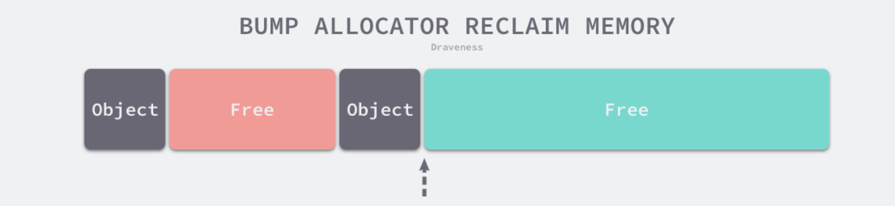
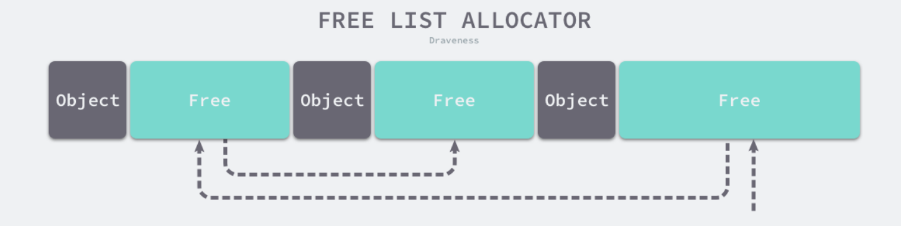
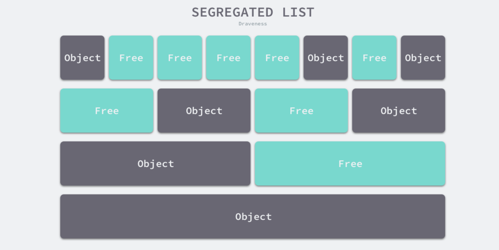
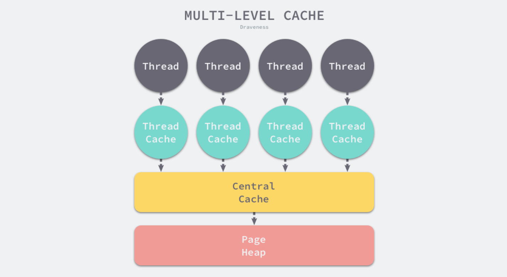
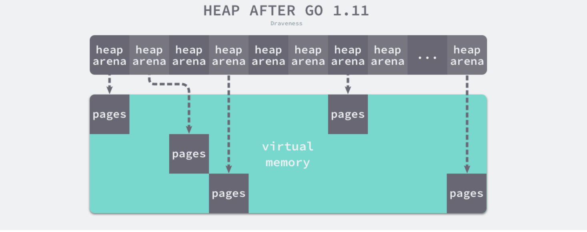

# 内存

## 操作系统内存管理

### Go内存管理

#### 内存分配器
Go程序中数据的变量会被分配到程序所在**虚拟内存**中,内存空间中包含两个重要区域: 栈区(stack)和堆区(heap).栈中的内存会由编译器进行管理,Go中堆内存会由工程师与编译器共同管理.

### 两种分配方法

#### 线性分配器
- **分配方法**   
线性分配（Bump Allocator）是一种高效的内存分配方法，但是有较大的局限性。当我们使用线性分配器时，只需要在内存中维护一个指向内存特定位置的指针，如果用户程序向分配器申请内存，分配器只需要检查剩余的空闲内存、返回分配的内存区域并修改指针在内存中的位置，即移动下图中的指针：

**图 2-1 线性分配器**   

	虽然线性分配器实现为它带来了较快的执行速度以及较低的实现复杂度，但是线性分配器无法在内存被释放时重用内存。如下图所示，如果已经分配的内存被回收，线性分配器无法重新利用红色的内存：

**图 2-2 线性分配器**   

	因为线性分配器具有上述特性，所以需要与合适的垃圾回收算法配合使用，例如：标记压缩（Mark-Compact）、复制回收（Copying GC）等算法，它们可以通过拷贝的方式整理存活对象的碎片，将空闲内存定期合并，这样就能利用线性分配器的效率提升内存分配器的性能了。
- **线性分配器相关垃圾回收算法**   
	- 标记压缩算法
	标记压缩算法主要分为两个阶段:标记阶段与压缩阶段.
	1. 标记阶段   
	标记阶段与标记清楚法标记阶段是一样.
	2. 压缩阶段
	压缩阶段的工作是移动所有可达对象到堆内存的同一个区域,从而将所有空闲内存线性排布以供下次分配.
	3. 算法实现
	Two-Finger算法,LISP2算法
	- 复制回收算法
	1. 标记阶段   
	同上
	2. 复制阶段
	将已经标记的活动对象复制到其他空间,把原有空间的所有对象回收.

#### 空闲链表分配器
空闲链表分配器（Free-List Allocator）可以重用已经被释放的内存，它在内部会维护一个类似链表的数据结构。当用户程序申请内存时，空闲链表分配器会依次遍历空闲的内存块，找到足够大的内存，然后申请新的资源并修改链表：

**图 2-3 空间链表分配器**   
需要注意由于内存块通过指针构成了链表,所以再适配内存时,需要消耗$O(n)$的时间复杂度.内存块的分配策略也有常见的四种方式:
* 首次适应 （First-Fit）— 从链表头开始遍历，选择第一个大小大于申请内存的内存块；
* 循环首次适应 （Next-Fit）— 从上次遍历的结束位置开始遍历，选择第一个大小大于申请内存的内存块；
* 最优适应 （Best-Fit）— 从链表头遍历整个链表，选择最合适的内存块；
* 隔离适应 （Segregated-Fit）— 将内存分割成多个链表，每个链表中的内存块大小相同，申请内存时先找到满足条件的链表，再从链表中选择合适的内存块；

上述四种策略的前三种就不过多介绍了，Go 语言使用的内存分配策略与第四种策略有些相似，我们通过下图了解该策略的原理：

**图 2-4 隔离适应策略**   
如上图所示，该策略会将内存分割成由 4、8、16、32 字节的内存块组成的链表，当我们向内存分配器申请 8 字节的内存时，它会在上图中找到满足条件的空闲内存块并返回。隔离适应的分配策略减少了需要遍历的内存块数量，提高了内存分配的效率。

### 分级分配 
线程缓存分配（Thread-Caching Malloc，TCMalloc）是用于分配内存的机制，它比 glibc 中的 malloc 还要快很多2。Go 语言的内存分配器就借鉴了 TCMalloc 的设计实现高速的内存分配，它的核心理念是使用多级缓存将对象根据大小分类，并按照类别实施不同的分配策略。

### 对象大小
Go 语言的内存分配器会根据申请分配的内存大小选择不同的处理逻辑，运行时根据对象的大小将对象分成微对象、小对象和大对象三种：
|类别|大小|
|----|----|
|微对象|(0,16B)|
|小对象|[16B,32KB]|
|大对象|(32KB,+$\infty$)|

### 多级缓存 
内存分配器不仅会区别对待大小不同的对象，还会将内存分成不同的级别分别管理，TCMalloc 和 Go 运行时分配器都会引入线程缓存（Thread Cache）、中心缓存（Central Cache）和页堆（Page Heap）三个组件分级管理内存：

- 线程缓存   
线程缓存是属于每一个线程的,它能满足绝大多数的内存分配需求.
- 中心缓存
当线程缓存不能满足需求的时候,中心缓存可以作为补充解决小对象的内存分配.
- 页堆
在遇到32KB以上的对象时,内存分配会选择页堆分配大内存.

### 线性内存
Go 语言程序的 1.10 版本在启动时会初始化整片虚拟内存区域，如下所示的三个区域 spans、bitmap 和 arena 分别预留了 512MB、16GB 以及 512GB 的内存空间，这些内存并不是真正存在的物理内存，而是虚拟内存：

**堆区的线性内存**
* **spans** 区域存储了指向内存管理单元 runtime.mspan 的指针，每个内存单元会管理几页的内存空间，每页大小为 8KB；
* **bitmap** 用于标识 arena 区域中的那些地址保存了对象，位图中的每个字节都会表示堆区中的 32 字节是否空闲；
* **arena** 区域是真正的堆区，运行时会将 8KB 看做一页，这些内存页中存储了所有在堆上初始化的对象；

### 稀疏内存
在Go1.11版本之后,Go对于堆内存的管理采用的是稀疏内存方案.主要是为了解决**使用线性内存导致的地址冲突,以及与C语言混编的内存分配问题**.但是由于采用了稀疏内存管理,失去了内存连续性的优势,这使得内存管理更加复杂.
   

如上图所示，运行时使用二维的 runtime.heapArena 数组管理所有的内存，每个单元都会管理 64MB 的内存空间：